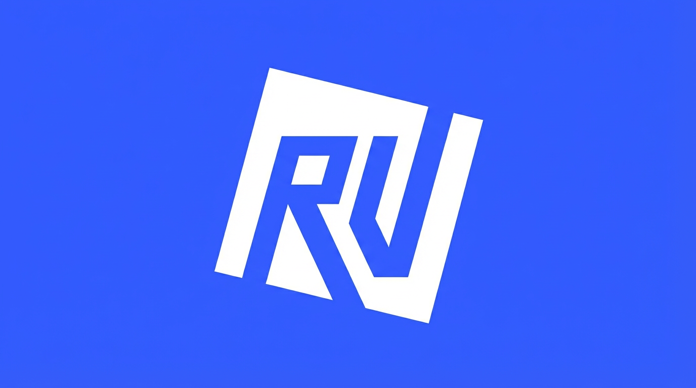

<p align="center">
  
</p>

<p align="center">
  Free and open source MCP server that lets AI assistants control Roblox Studio.
</p>

## Quick Setup

1. Download the latest release for your OS from [Releases](https://github.com/jasprcodess/RoVibe-Roblox-MCP/releases)
2. Run it (Windows: `RoVibe-Installer.exe`, macOS: `chmod +x rovibe-mcp-macos && ./rovibe-mcp-macos`)
3. Restart Roblox Studio and your AI client

That's it. The installer handles the plugin, config files, and everything else.

## What This Does

This is a bridge between AI apps (Claude, Cursor, etc.) and Roblox Studio. You talk to the AI, it sends commands through this server, and the Studio plugin executes them. You can build things, inspect your game, run code, and more.

```
AI Assistant  <--stdio-->  RoVibe MCP Server  <--HTTP:44755-->  Roblox Studio Plugin
```

Multiple AI clients can connect at the same time. Extra instances automatically proxy through the first one.

## Setup

### Windows
1. Download `RoVibe-Installer.exe` from [Releases](https://github.com/jasprcodess/RoVibe-Roblox-MCP/releases)
2. Run the installer, it walks you through everything
3. Restart Roblox Studio and your AI client

### macOS
1. Download `rovibe-mcp-macos` from [Releases](https://github.com/jasprcodess/RoVibe-Roblox-MCP/releases)
2. Run `chmod +x rovibe-mcp-macos && ./rovibe-mcp-macos` to install
3. Restart Roblox Studio and your AI client

### From Source
```bash
git clone https://github.com/jasprcodess/RoVibe-Roblox-MCP.git
cd RoVibe-Roblox-MCP
cargo build --release

# Install (Windows):
.\target\release\rovibe-mcp.exe
# Install (macOS):
./target/release/rovibe-mcp
```

### Manual Config

Add to your MCP client config:
```json
{
  "mcpServers": {
    "RoVibe_Studio": {
      "command": "/path/to/rovibe-mcp",
      "args": ["--stdio"]
    }
  }
}
```

**Config paths:**
- `%APPDATA%\Claude\claude_desktop_config.json` (Windows)
- `~/Library/Application Support/Claude/claude_desktop_config.json` (Mac)
- `~/.cursor/mcp.json` (Cursor)

## Tools

11 tools are included:

| Tool | What It Does |
|------|-------------|
| `run_code` | Run Luau code in Studio. Reports what instances were created/removed. |
| `insert_model` | Search the marketplace and insert a model |
| `create_instance` | Create a single instance with properties (auto-anchors parts) |
| `get_descendants` | Get the instance tree as JSON, includes position, size, color, material for parts |
| `get_properties` | Read properties of a specific instance |
| `get_selection` | See what the user has selected in Studio |
| `read_script` | Read source code of a script |
| `get_console_output` | Get recent output console messages |
| `get_studio_mode` | Check if Studio is in Edit, Play, or Run mode |
| `start_stop_play` | Start or stop play mode |
| `run_script_in_play_mode` | Run code in play mode with a timeout, then auto-stop |

The server also includes a system prompt that teaches the AI Roblox's coordinate system (Y is up, position is center of part, etc.), building patterns, and common spatial math. This helps the AI build things correctly without you having to explain it every time.

## Project Structure

```
.
├── src/
│   ├── main.rs              # Entry point, stdio MCP + HTTP bridge
│   ├── server.rs            # Tool definitions, HTTP handlers, proxy logic
│   ├── install.rs           # Plugin installer + client config setup
│   └── error.rs             # Error types
├── studio-plugin/
│   ├── src/
│   │   ├── Main.server.luau          # Plugin entry + tool dispatch
│   │   ├── MockWebSocketService.luau # HTTP long-polling client
│   │   ├── Types.luau                # Type definitions
│   │   ├── Tools/                    # One file per tool
│   │   └── Utils/                    # Shared utilities
│   └── default.project.json          # Rojo build config
├── installer/
│   ├── installer.py           # GUI installer (CustomTkinter)
│   ├── installer_logic.py     # Install logic, file ops, config writing
│   ├── requirements.txt       # Python dependencies
│   └── build_installer.bat    # PyInstaller build script
├── build.rs                           # Compiles plugin via Rojo at build time
├── Cargo.toml
└── .github/workflows/build.yml       # CI, Windows + macOS builds + releases
```

## Acknowledgments

Originally forked from [Roblox/studio-rust-mcp-server](https://github.com/Roblox/studio-rust-mcp-server). We've since rewritten large parts of the codebase but the core architecture comes from their work.

## License

MIT. Free and open source, do whatever you want with it.
